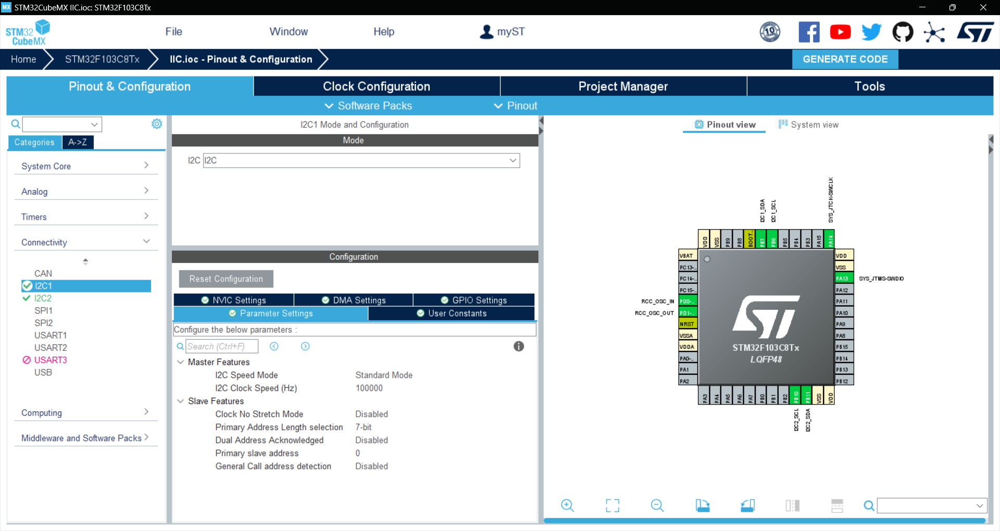

# IIC

IIC(MASTER AND SLAVE)

## 硬件

- 1.54 寸 OLED(七针)
- stm32f103c8t6(两个 IIC 通信)
  ~~采用硬件 IIC~~

## 接线方式

- OLED

```C
#define OLED_SCL_Clr() HAL_GPIO_WritePin(GPIOA,GPIO_PIN_0,GPIO_PIN_RESET)//SCL
#define OLED_SCL_Set() HAL_GPIO_WritePin(GPIOA,GPIO_PIN_0,GPIO_PIN_SET)

#define OLED_SDA_Clr() HAL_GPIO_WritePin(GPIOA,GPIO_PIN_1,GPIO_PIN_RESET)//SDA
#define OLED_SDA_Set() HAL_GPIO_WritePin(GPIOA,GPIO_PIN_1,GPIO_PIN_SET)

#define OLED_RES_Clr() HAL_GPIO_WritePin(GPIOA,GPIO_PIN_2,GPIO_PIN_RESET)//RES
#define OLED_RES_Set() HAL_GPIO_WritePin(GPIOA,GPIO_PIN_2,GPIO_PIN_SET)

#define OLED_DC_Clr()  HAL_GPIO_WritePin(GPIOA,GPIO_PIN_3,GPIO_PIN_RESET)//DC
#define OLED_DC_Set()  HAL_GPIO_WritePin(GPIOA,GPIO_PIN_3,GPIO_PIN_SET)

#define OLED_CS_Clr()  HAL_GPIO_WritePin(GPIOA,GPIO_PIN_4,GPIO_PIN_RESET)//CS
#define OLED_CS_Set()  HAL_GPIO_WritePin(GPIOA,GPIO_PIN_4,GPIO_PIN_SET)

```

- IIC
  - 主机
  ```C
  GPIO_InitStruct.Pin = GPIO_PIN_6|GPIO_PIN_7;
  GPIO_InitStruct.Mode = GPIO_MODE_AF_OD;
  GPIO_InitStruct.Speed = GPIO_SPEED_FREQ_HIGH;
  HAL_GPIO_Init(GPIOB, &GPIO_InitStruct);
  ```
  - 从机
  ```C
  GPIO_InitStruct.Pin = GPIO_PIN_10|GPIO_PIN_11;
  GPIO_InitStruct.Mode = GPIO_MODE_AF_OD;
  GPIO_InitStruct.Speed = GPIO_SPEED_FREQ_HIGH;
  HAL_GPIO_Init(GPIOB, &GPIO_InitStruct);
  ```
## CubeMx配置
